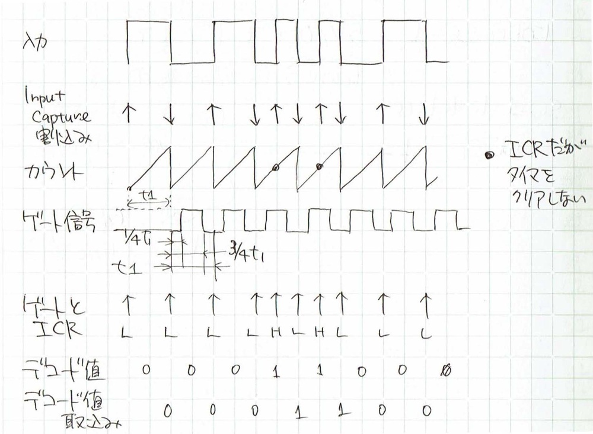
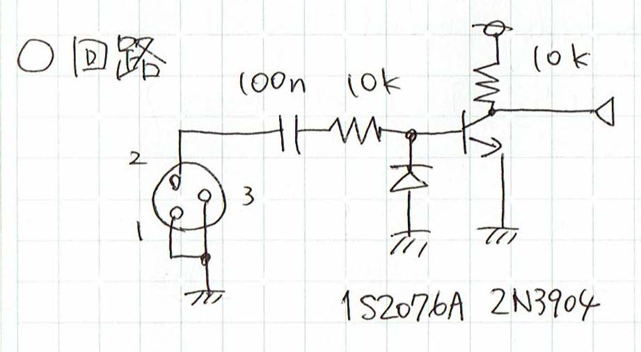

# SMPTE_TC
[SMPTE-LTCリーダのAVRマイコンへの実装 - DIY Fx and Synthesizer](https://scrapbox.io/diyfx/SMPTE-LTC%E3%83%AA%E3%83%BC%E3%83%80%E3%81%AEAVR%E3%83%9E%E3%82%A4%E3%82%B3%E3%83%B3%E3%81%B8%E3%81%AE%E5%AE%9F%E8%A3%85)

ワンチップマイコンでSMPTE-LTCの読み書きの技術を習得しておくと製作に利用できるかと考え、このプロジェクトを始めました。

## 動作の仕組み
SMPTE-LTCのバイフェーズをマイコン・タイマの Input Caputre 割り込みを利用してデコードする。
使用するマイコンは ATmega48/88/168/328 を想定し、処理の要となるタイマとしてTimer1を利用する。

- Timer1 の Input Capture のトリガには回路で整形された入力信号を接続している 
- Input Capture はエッジで割り込み、割り込まれた際には、割り込み対象エッジを毎回反転する
- Input Capture割り込みが発生し、GATE（後述）がLであるときは ICR を保存する（計測時間 period）。timer値 はクリアする。
- 上で測った period を元にゲート信号（GATE）を作る
  - ゲート信号（GATE）は period の 1/4 でセット、3/4 でクリアされる
  - 波形生成に際しては OCR1A、OCR1B を利用している
- Input Capture割り込みでハンドラに飛んだときに、GATE==H ならデコード値は "１" である
- Input Capture割り込みでハンドラに飛んだときに、GATE==L なら デコード値は "０" である（正式には- Recovery Clockでラッチすべきではある）
- 生成されたゲート信号はバイフェーズから Recover した Clock になっている

## 製作情報

### 入力部回路図

### ソースコード
デコードしたSMPTE-LTCをSPI-7segに表示するサンプルプログラム。使用する表示デバイスに合わせて変更してください。

## 参考文献
- [ファイルベース時代に学ぶ ビデオ技術（基礎編）第4回：タイムコードの概要と使用法 | ビデオ α](http://www.videoalpha.jp/basic/6956.html)
- [Linear timecode - Wikipedia](https://en.wikipedia.org/wiki/Linear_timecode)
- [LTC Two](https://elteesee.pehrhovey.net/)
- 関口; 定率遅延回路によるVTR編集用タイムコードの簡易復調法, pp.489-494, テレビジョン学会誌 35(6) (1981)
[Link](https://www.jstage.jst.go.jp/article/itej1978/35/6/35_6_489/_article/-char/ja/)